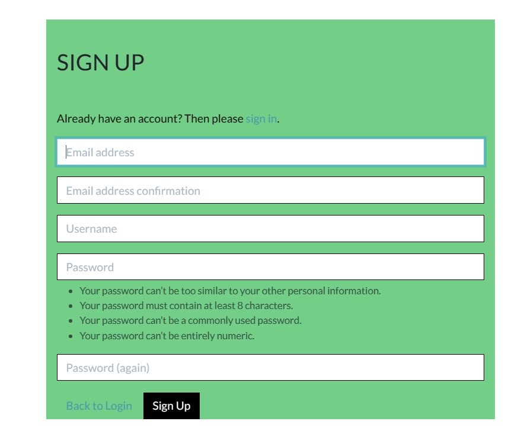
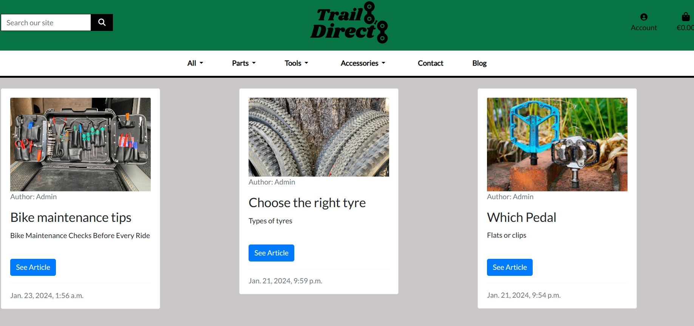
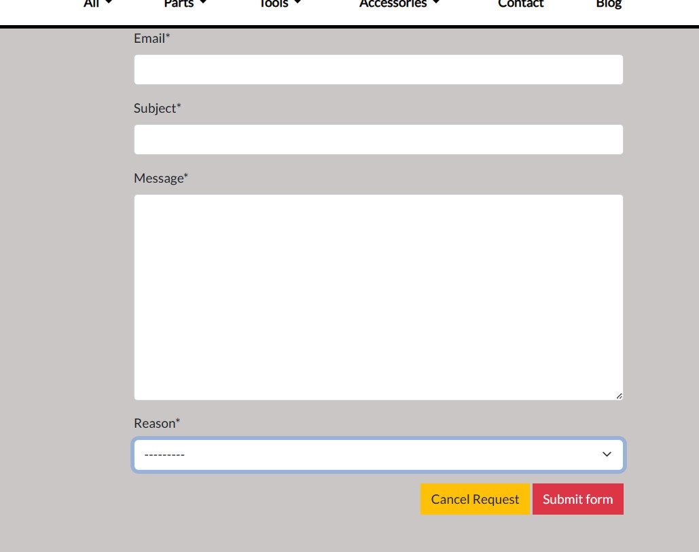
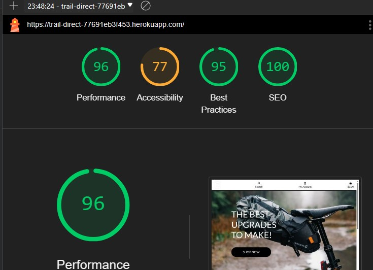

# Trail Direct

## A e-commerce site designed to provide mountain bike cyclists with the best upgrades and accorriess to maximize their mountain bike experiences.

## Trail Direct

## Table of contents
<a name="contents">Back to Top</a>
 1. [ Business Model ](#business)
 2. [ UX ](#ux)
 3. [ SEO ](#seo)
 4. [Agile Development](#agile)
 5. [ Features ](#features)  
 6. [ Features Left to Implement ](#left)  
 7. [ Technology used ](#tech) 
 8. [ Testing ](#testing)  
 9. [ Bugs ](#bugs)  
 10. [ Deployment](#deployment)
 11. [ Credits](#credits)
 12. [ Content](#content)  
 13. [ Acknowledgements](#acknowledgements) 


<a name="ux"></a>

### Wireframes

Wireframes were created for the website layout including mobile wireframes for pages that have a slightly different layout to the desktop version.

Some slight layout differences exist between the finished website and the wireframes.

- WireFrames 
    

<details>
<summary> Index page </summary>
<br>
    
</details>

<details>
<summary> Mobile page </summary>
<br>
    
</details>

<details>
<summary> Login Wireframe </summary>
<br>
    
</details>

<details>
<summary> Register Wireframe </summary>
<br>
    
</details>

<details>
<summary> Product Page Wireframe </summary>
<br>
    
</details>

#### Database Schema

Pre-project planning involved generating an entity relationship diagram. This was done in order to create a clear plan as to how all of the database models interact with each other. This was also done to determine what data fields were needed for each model. The review & question model was not implented due to time contraint. The relationship between each model and another is noted in the diagram with "FK" denoting Foreign Key. 
<details>
<summary>Entity Relationship Diagram</summary>


## Features

The main features of the website are documented in this section.

- Navigation
    - The navigation bar is available throughout the website. It is attached to the base. It contains all the relevant links for users to use the site. Extra admin links are displayed for an admin logged in so that changes to the site can be made. The center logo is a link to the home page. The bag item in the right corner displays the current bag total and links to the checkout.
<details>
<summary> Navigation </summary>
    
</details>
<details>
<summary> Navigation Admin </summary>
    
</details>
    - On mobile the navigation bar collapses.
<details>
<summary> Navigation Mobile </summary>
    
</details>
    - In the footer on every page, there are links to other internal pages plus external links to socials.
<details>
<summary> Navigation Footer </summary>
    
</details>
- Authentication
    - The authentication for the site is handled by Django Allauth and links to the main login, logout & register pages are found in the account section of the navbar. Messages are displayed to the user if there is an error with their imputs.
<details>
<summary> Register Page </summary>
    
</details>

<a name="testing"></a>

<details>
<summary> Mobile Navigation </summary>
<br>
    
</details>

<details>
<summary> Catagory Cards </summary>
<br>
    
</details>

<details>
<summary> Products Page </summary>
<br>
    
</details>

## Testing 

### Testing Phase

### Manual Testing

<details>
<summary>Account Registration Tests </summary>
<br>

<a name="tech"></a>
##  Technology Used
### Html
 - Used to structure the website

### CSS
 - Custom CSS was written to make the site as close to the wireframes.

### JavaScript
 -  Used to add timeout function for messages as well as to enable the menu on index.html

### Python
 -  Used for the logic in this project.

### Django
 -  Framework used to build this project.

### Font Awesome
 -  Icon library used in the navigstion bar and footer.

### Bootstrap 5
 - Used as the base front end framework to work alongside Django

### GitHub
 - Used to store the code for this project & for the projects Kanban board used to complete it.

### Heroku
 - Used to host and deploy this project

### ElephantSQL
 - Storage for the database

### Git
- Used for version control throughout the project and to ensure a good clean record of work done was maintained.

### AWS S3 and IAM
- Used to host static and media files for this project and IAM for the permissions based roles for accessing the S3 buckets.

### Stripe
- Stripe is used to handle website payments.

### Django-Crispy-Forms
- Used to style the forms in this project.

[Back to Top of page](#contents)

<a name="features"></a>

## Features

The main features of the website are documented in this section.

- Navigation
    - The navigation bar is available throughout the website. It is attached to the base. It contains all the relevant links for users to use the site. Extra admin links are displayed for an admin logged in so that changes to the site can be made. The center logo is a link to the home page. The bag item in the right corner displays the current bag total and links to the checkout.
<details>
<summary> Navigation </summary>
    
</details>
<details>
<summary> Navigation Admin </summary>
    
</details>
    - On mobile the navigation bar collapses.
<details>
<summary> Navigation Mobile </summary>
    
</details>
    - In the footer on every page, there are links to other internal pages plus external links to socials.
<details>
<summary> Navigation Footer </summary>
    
</details>
- Authentication
    - The authentication for the site is handled by Django Allauth and links to the main login, logout & register pages are found in the account section of the navbar. Messages are displayed to the user if there is an error with their imputs.
<details>
<summary> Register Page </summary>
    
</details>
- Confirmation Email
	- New user gets sent a email to confirm their details and finish registration.
<details>
<summary> Email Confirmation </summary>
    
</details>
- Products
	The products are displayed under various heading, based on slected catagories or sorted by price.
<details>
<summary> Products Page </summary>
    
</details>
<details>
<summary> Products Page </summary>
    
</details>
<details>
<summary> Products Details </summary>
    
</details>
<details>
<summary> Products Details </summary>
    
</details>
	- Catagories of products could be slected on the home page through the cars below the hero image.
<details>
<summary> Product Catagory Home Page </summary>
    
</details>
- Product Admin
	- When the admin is signed-in, they get access to addional buttons to edit the products and add products in the navbar.
<details>
<summary> Admin Products </summary>
    
</details>
<details>
<summary> Admin Edit Products </summary>
    
	
	
</details>
<details>
<summary> Admin Add Products </summary>
    
</details>
-Shopping Bag
	The bag contains the list of products that the user has added to possibly purchase. The quantities of the products can be adjusted in the bag as well as product deletion. The overall price and extra charges are calculated in the bag before checkout.
<details>
<summary> Bag Details </summary>
    
</details>
<details>
<summary> Bag Remove Item </summary>
    
</details>
- Checkout
	- The checkout page contains more details on the users order, the final charges and the delivery address of the products is be entered.
<details>
<summary> Checkout Details </summary>
    
</details>
<details>
<summary> Delivery Details </summary>
    
</details>
<details>
<summary> Stripe Details </summary>
    
</details>
	- Once payment goes through, the user will be shown a confirmation page which confirms all the details of the transiation.
<details>
<summary> Order Confirmation </summary>
    
</details>
- Blog
	- The blog page shows articles posed by the admin.
<details>
<summary> Blog Page </summary>
    
</details>
<details>
<summary> Blog Detail </summary>
    
</details>
	- Blog admin can edit, delete or add blog posts when signed in as admins.
<details>
<summary> Admin Blog </summary>
    
</details>
- Contact
	- A contact page is accessable for all users, where a FAQ is also to provide users answers to any issues they had. There is a support email that is accessable to logged-in users to help with order issues.
<details>
<summary> Contact </summary>
    
</details>
<details>
<summary> Contact Form </summary>
    
</details>
<details>
<summary> FAQ </summary>
    
</details>
- Newsletter
	- The newsletter is for users to sign up with their email to recieve updates from the site.
<details>
<summary> Newsletter </summary>
    
</details>
	- Admin page for sending newsletter to subcribed users.
<details>
<summary> Newsletter Admin </summary>
    
</details>
- Privacy Policy
<details>
<summary> Privacy Policy </summary>
    
</details>
- 404 Error Page
<details>
<summary> 404 Error </summary>
    
</details>
- Restrictions
	- Users are redirected from pages they do not have authorization to view. They are brought back to the home page or sent to sign in page.

	


<a name="testing"></a>

<details>
<summary> Mobile Navigation </summary>
<br>
    
</details>

<details>
<summary> Catagory Cards </summary>
<br>
    
</details>

<details>
<summary> Products Page </summary>
<br>
    
</details>

## Testing 

### Testing Phase

### Manual Testing

<details>
<summary>Account Registration Tests </summary>
<br>

| Test |Result  |
| -- | -- |
| User can create an account | Pass |
| Verified user can log into their account | Pass  |
| Verified user can log out | Pass  |
|User is notified of logging in to account| Pass |
|User is notified of logging out of account| Pass |
|User receives email verification email| Pass |

</details>

<details>
<summary>Home Page Tests</summary>
<br>

|Section|Test|Pass/Fail|
| ---| ---|---|
|Navbar|Click on logo in Navbar redirects to Home |Pass|
||Clicking on the links in Navbar redirects to the correct page |Pass|
||Clicking on the links in Account redirects to the correct page |Pass|
||Clicking on the bag icon redirects to shopping bag |Pass|
|Searchbar|Type keywords returns correct results |Pass|
|Hero section|Opening Home page the hero section loads as it should |Pass|
||Click on the shop now button leads to products page |Pass|
|Catagory Card| Click on the catagory card redirects to the correct catagory of products |Pass|
|Newsletter| Enter valid email and a thank you for subscribing text appears |Pass|
|Footer|The site links in footer open to the relevent pages|Pass|
||The socail links in footer open to the external pages|Pass|
|Admin|The admin can access the admin only dropdown menu after logging-in |Pass|

</details>

<details>
<summary>Products Page Tests</summary>
<br>

|Section|Test|Pass/Fail|
| ---| ---|---|
|Sorting| Click on product sorting in Navigation bar shows sorted products |Pass|
|Details| User can see product details button |Pass|
|Admin| Admins can see edit and delete buttons on each product |Pass|

</details>

<details>
<summary>Detailed Products Page Tests</summary>
<br>

|Section|Test|Pass/Fail|
| ---| ---|---|
|Product details|Opens the product page to show all the relevant information on selected product |Pass|
|| Clicking on add to bag button adds selected product to bag |Pass|
|| Clicking on add the quantity selector adjusts the product quantity |Pass|
|| Product catagory of product is displayed |Pass|
|| Product price is shown correctly |Pass|
|| Tab section displays the product details |Pass|
|Questions| Question tab section links to the general contact |Pass|

</details>

<details>
<summary>Shopping Bag Tests</summary>
<br>

|Section|Test|Pass/Fail|
| ---| ---|---|
|Shopping bag|Add product to the bag and it appears correctly in the bag |Pass|
|Update quantity|Updating product new quantity and update the bag and price |Pass|
|Remove product|Click on the remove button and the product is removed from bag |Pass|

</details>

<details>
<summary>Checkout Tests</summary>
<br>

|Section|Test|Pass/Fail|
| ---| ---|---|
|Payments|Users can successfully make a payment on orders |Pass|
||Loged-In Users can successfully make a payment on orders |Pass|
||If payment fails an error code will show and order is not submitted |Pass|
|Email|Users recieve an email confirmation of email after payment |Pass|
|Order|Order confirmation page after payment is successful |Pass|
||If an error when processing the order the site returns a 500 error without processing order |Pass|

</details>

<details>
<summary>Blog Tests</summary>
<br>

|Section|Test|Pass/Fail|
| ---| ---|---|
|Blog|All Users can view the list of posted articles |Pass|
||All Users can view selected detailed articles |Pass|
|Admin|Admins can add blog post on page |Pass|
||Admins can edit blog posts on page |Pass|
||Admins can delete blog post on page |Pass|


</details>

<details>
<summary>Profile Tests</summary>
<br>

|Section|Test|Pass/Fail|
| ---| ---|---|
|Profile|Only logged-in users can view profile section |Pass|
||logged-in users can view profile details |Pass|
||Only logged-in users can update personal details |Pass|
||logged-in users can update order delivery details |Pass|
||logged-in users can update personal details |Pass|
||logged-in users can change password |Pass|
||logged-in users can delete profile |Pass|
||logged-in users can view previous orders |Pass|

</details>

### Google Lighthouse Testing

> index.html

<details>
<summary>Index.html Screenshot</summary>
  <br>

  

</details>

> products.html

<details>
<summary>Profiles.html Screenshot</summary>
  <br>

   
  
</details>

<a name="deployment"></a>

## Deployment and Local Development
The live deployed version of the website can be found on [Heroku](https://trail-direct-77691eb3f453.herokuapp.com/). The steps and technologies involved in deploying it are outlined below. The steps on how to fork or clone the repository for the website are also outlined.

### ElephantSQL Database

The PostgreSQL Database for this project was obtained using [ElephantSQL](https://www.elephantsql.com), a service which you can sign-up to with your GitHub account. Once signed up follow these steps:

- Click **Create New Instance** to start a new database.
- Name used: `Trail Direct`.
- Select the **Tiny Turtle (Free)** plan.
- **Tags** can be left blank.
- Normally you select the **Region** and **Data Center** closest to you in this case EU-West-1.
- For my project, I had to select a differnt region (West-US) as this provided a newer Postgres version that was needed for my project requirements.
- Once created, click on the new database name, where you can view the database URL which will be needed for the Heroku Config Vars.

### Amazon AWS

This project uses [Amazon Web Services (AWS)](https://aws.amazon.com) to store its media and static files.

Once you've created an AWS account and logged-in, navigate to the **AWS Management Console** page & follow these series of steps to get your project connected.

#### S3 Bucket

- Search for **S3**.
- Create a new bucket, give it a name (matching your Heroku app name), and choose the region closest to you.
- Uncheck **Block all public access**, and acknowledge that the bucket will be public (required for it to work on Heroku).
- From **Object Ownership**, make sure to have **ACLs enabled**, and **Bucket owner preferred** selected.
- From the **Properties** tab, turn on static website hosting, and type `index.html` and `error.html` in their respective fields, then click **Save**.
- From the **Permissions** tab, paste in the following CORS configuration:

	```shell
	[
		{
			"AllowedHeaders": [
				"Authorization"
			],
			"AllowedMethods": [
				"GET"
			],
			"AllowedOrigins": [
				"*"
			],
			"ExposeHeaders": []
		}
	]
	```

- Copy your **ARN** string.
- From the **Bucket Policy** tab, select the **Policy Generator** link, and use the following steps:
	- Policy Type: **S3 Bucket Policy**
	- Effect: **Allow**
	- Principal: `*`
	- Actions: **GetObject**
	- Amazon Resource Name (ARN): **paste-your-ARN-here**
	- Click **Add Statement**
	- Click **Generate Policy**
	- Copy the entire Policy, and paste it into the **Bucket Policy Editor**

		```shell
		{
			"Id": "Policy1234567890",
			"Version": "2012-10-17",
			"Statement": [
				{
					"Sid": "Stmt1234567890",
					"Action": [
						"s3:GetObject"
					],
					"Effect": "Allow",
					"Resource": "arn:aws:s3:::your-bucket-name/*"
					"Principal": "*",
				}
			]
		}
		```

	- Before you click "Save", add `/*` to the end of the Resource key in the Bucket Policy Editor (like above).
	- Click **Save**.
- From the **Access Control List (ACL)** section, click "Edit" and enable **List** for **Everyone (public access)**, and accept the warning box.
	- If the edit button is disabled, you need to change the **Object Ownership** section above to **ACLs enabled** (mentioned above).

#### IAM

Back on the AWS Services Menu, search for and open **IAM** (Identity and Access Management).
Once on the IAM page, follow these steps:

- From **User Groups**, click **Create New Group**.
	- Name: `manage-trail-direct`
- Tags are optional, but you must click it to get to the **review policy** page.
- From **User Groups**, select your newly created group, and go to the **Permissions** tab.
- Open the **Add Permissions** dropdown, and click **Attach Policies**.
- Select the policy, then click **Add Permissions** at the bottom when finished.
- From the **JSON** tab, select the **Import Managed Policy** link.
	- Search for **S3**, select the `AmazonS3FullAccess` policy, and then **Import**.
	- You'll need your ARN from the S3 Bucket copied again, which is pasted into the "Resource" key on the Policy.

		```shell
		{
			"Version": "2012-10-17",
			"Statement": [
				{
					"Effect": "Allow",
					"Action": "s3:*",
					"Resource": [
						"arn:aws:s3:::your-bucket-name",
						"arn:aws:s3:::your-bucket-name/*"
					]
				}
			]
		}
		```
	
	- Click **Review Policy**.
	- Name: `trail-direct-policy`
	- Provide a description:
		- "Access to S3 Bucket for Trail Direct static files."
	- Click **Create Policy**.
- From **User Groups**, click `manage-trail-direct`.
- Click **Attach Policy**.
- Search for the policy you've just created (`trail-direct-policy`) and select it, then click **Attach Policy**.
- From **User Groups**, click **Add User**.
	- Name: `trail-direct-staticfiles-user`
- For "Select AWS Access Type", select **Programmatic Access**.
- Select the group to add your new user to: `manage-trail-direct`
- Tags are optional, but you must click it to get to the **review user** page.
- Click **Create User** once done.
- You should see a button to **Download .csv**, so click it to save a copy on your system.
- If you don't see an option to downlod the CSV file go to IAM and select **Users**
- Select the user for whom you wish to create a CSV file.
- Select the **Security Credentials** tab.
- Scroll to **Access Keys** and click **Create access key**
- Select **Application running outside AWS**, and click next.
- On the next screen, you can leave the **Description tag** value blank. Click **Create Access Key**.
- Click the **Download .csv file** button.
    - **IMPORTANT**: once you pass this page, you cannot come back to download it again, so do it immediately!
	- This contains the user's **Access key ID** and **Secret access key**.
	- `AWS_ACCESS_KEY_ID` = **Access key ID**
	- `AWS_SECRET_ACCESS_KEY` = **Secret access key**
- These will be needed for the Heroku Config Vars.

#### Final AWS Setup

- Follow the steps described later for [Heroku Deployment](#heroku-deployment) and then return here to follow these final AWS steps below.
- If Heroku Config Vars has `DISABLE_COLLECTSTATIC` still, this can be removed now, so that AWS will handle the static files.
- Back within **S3**, create a new folder called: `media`.
- Inside the media file select **Upload** and **Add Files**.
- Select the images from your hard-drive that you wish to upload.
- Under **Manage Public Permissions**, select **Grant public read access to this object(s)**.
- No further settings are required, so click next through to the end and **Upload**.

### Stripe API

This project uses [Stripe](https://stripe.com) to handle the ecommerce payments.

Once you've created a Stripe account and logged-in, follow these series of steps to get your project connected.

- From your Stripe dashboard, click **API keys for developers**.
- You'll have two keys here:
	- `STRIPE_PUBLIC_KEY` = Publishable Key (starts with **pk**)
	- `STRIPE_SECRET_KEY` = Secret Key - click **Reveal test key** (starts with **sk**)

As a backup, in case users prematurely close the checkout page during payment, we can include Stripe Webhooks.

- From your Stripe dashboard, click **Developers**, and select **Webhooks**.
- From there, click **Add Endpoint**.
	- `https://trail-direct-77691eb3f453.herokuapp.com/checkout/wh/`
- Click **receive all events**.
- Click **Add Endpoint** to complete the process.
- You'll have a new key here under "Signing secret":
	- `STRIPE_WH_SECRET` = Under signing Secret - click `Reveal` (starts with **wh**)

### Gmail API

This project uses [Gmail](https://mail.google.com) to handle sending emails to users for account verification and purchase order confirmations.

Once you've created a Gmail (Google) account and logged-in, follow these series of steps to get your project connected.

- Click on the **Account Settings** (cog icon) in the top-right corner of Gmail.
- Click on the **See all settings** link.
- Click on the **Accounts and Import** tab.
- Within the section called "Change account settings", click on the link for **Other Google Account settings**.
- This opens a page in a new tab, select **Security** on the left.
- Select **2-Step Verification** to turn it on (verify your password and account).
- Once verified, select **Turn On** for 2FA.
- Navigate back to the **Security** page, and you'll see a new option called **App passwords**.
- This might prompt you once again to confirm your password and account.
- Select **Mail** for the app type.
- Select **Other (Custom name)** for the device type.
	- Any custom name, such as "Django" or the project name.
- You'll be provided with a 16-character password (API key).
	- Save this somewhere locally, as you cannot access this key again later!
	- `EMAIL_HOST_PASS` = user's 16-character API key
	- `EMAIL_HOST_USER` = user's own personal Gmail email address

### Heroku Deployment

This project uses [Heroku](https://www.heroku.com) for deployment to the web. The deployment steps are as follows, after account setup:

- Select **New** in the top-right corner of your Heroku Dashboard, and select **Create new app** from the dropdown menu.
- Your app name must be unique, and then choose a region closest to you (EU or USA), and finally, select **Create App**.
- From the new app **Settings**, click **Reveal Config Vars**, and set your environment variables.

| Key | Value |
| --- | --- |
| `AWS_ACCESS_KEY_ID` | user's own value |
| `AWS_SECRET_ACCESS_KEY` | user's own value |
| `DATABASE_URL` | user's own postgres value |
| `DISABLE_COLLECTSTATIC` | 1 (*this is temporary, and can be removed for the final deployment*) |
| `EMAIL_HOST_PASS` | user's own value |
| `EMAIL_HOST_USER` | user's gmail |
| `SECRET_KEY` | user's own value |
| `STRIPE_PUBLIC_KEY` | user's own value |
| `STRIPE_SECRET_KEY` | user's own value |
| `STRIPE_WH_SECRET` | user's own value |
| `USE_AWS` | True |

Heroku needs two additional files in order to deploy properly.

- requirements.txt
- Procfile

You can install this project's **requirements** (where applicable) using:

- `pip3 install -r requirements.txt`

If you have your own packages that have been installed, then the requirements file need to be updated using:

- `pip3 freeze --local > requirements.txt`

Create a **Procfile** at the root level of the project:

- Open the Procfile and enter the following line of code: `web: gunicorn app_name.wsgi:application` and save.
- *replace **app_name** with the name of your primary Django app name; the folder where settings.py is located*.

For Heroku deployment, follow these steps to connect your own GitHub repository to the newly created app:

Either:

- Select **Automatic Deployment** from the Heroku app.

Or:

- Ensure Heroku is installed for these following commands to work.
- If it is not run `curl https://cli-assets.heroku.com/install.sh | sh` in the terminal/CLI.
- Then connect to Heroku using this command: `heroku login -i`
- Set the remote for Heroku: `heroku git:remote -a app_name` (replace *app_name* with your app name)
- After performing the standard Git `add`, `commit`, and `push` to GitHub, you can now type:
	- `git push heroku main`

The project should now be connected and deployed to Heroku!

### Local Development
The steps below describe how to fork or clone the repository if desired.
#### How to Fork
1. Log in to Github.
2. Navigate to the [repository](https://github.com/lukecdev/Trail-Direct) for this website.
3. Click the Fork button in the top right corner.
4. You will be brought to a new page with a short form to be completed.
5. Upon completing, click on the "Create fork" button and this will create a fork of the repository in your personal account.

#### How to Clone
1. Log in to GitHub.
2. Navigate to the [repository](https://github.com/lukecdev/Trail-Direct) for this website.
3. Click on the **Code** button and a modal will appear.
4. Within this modal select the local tab.
5. Within this tab there are HTTPS, SSH, or GitHub CLI tabs.
6. Click on the HTTPS tab and copy the link shown.
7. In your development environment open the terminal.
8. Change the current working directory to the location where you want the cloned directory to be.
9. Type `git clone` into the terminal, then paste the URL you copied in step 6.
10. Press **Enter** to create your local clone.
11. In the terminal install the requirements by using the following: `pip3 install -r requirements.txt`.
12. If you have your own packages that have been installed, then the requirements file needs to be updated using: `pip3 freeze --local > requirements.txt`.
13. Next create the env.py file which tells our project which variables to use.
14. Add env.py the file to a .gitignore file to prevent it from being pushed to github.
15. Start the Django app: `python3 manage.py runserver`.
16. Make migrations by running : `python3 manage.py makemigrations`
17. Then migrate those changes with `python3 manage.py migrate`
18. To view the website type `python3 manage.py runserver` into the terminal and open port 8000.
19. The project is now ready to work on locally and any changes made can viewed using port 8000.

[Back to top](#contents)

## testing 
# test