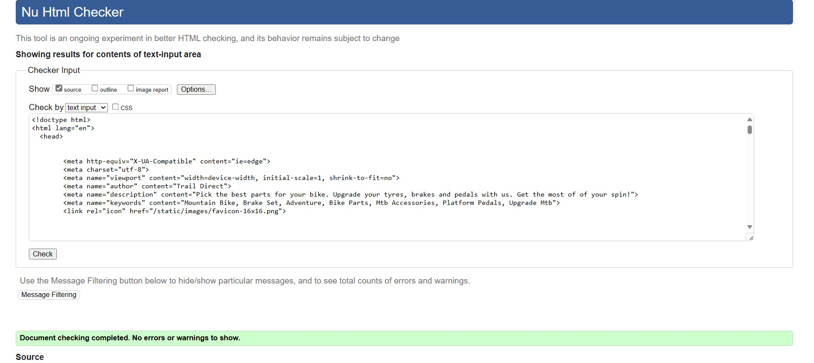
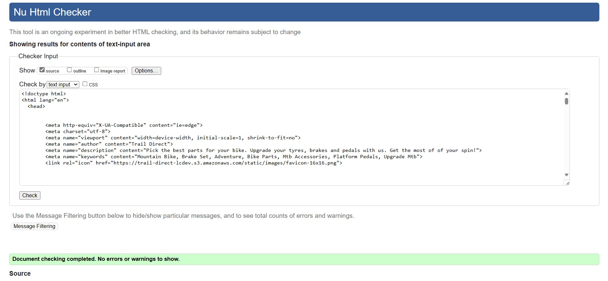
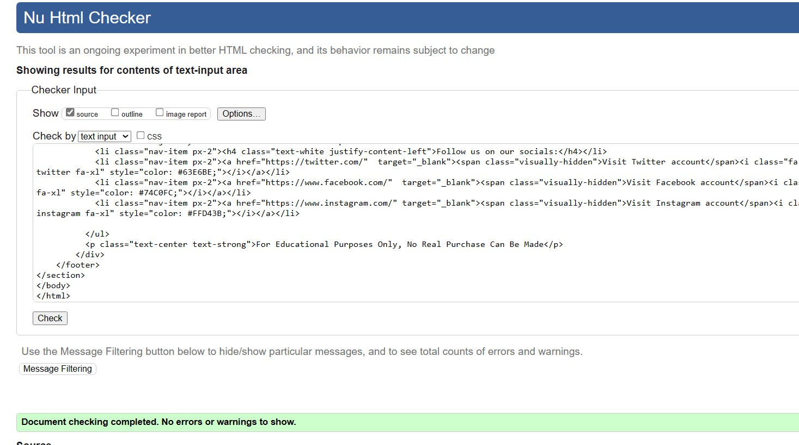
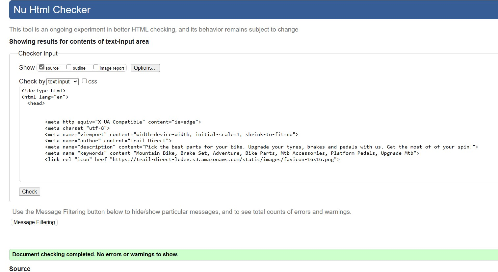
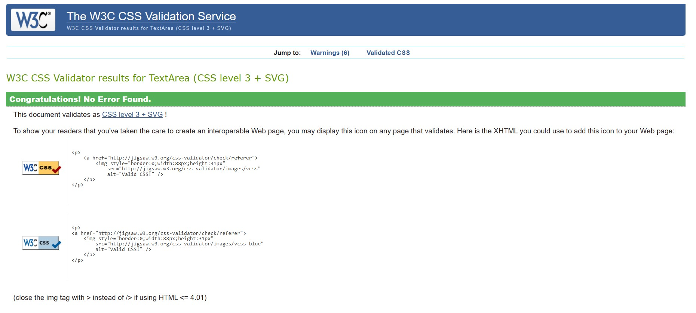
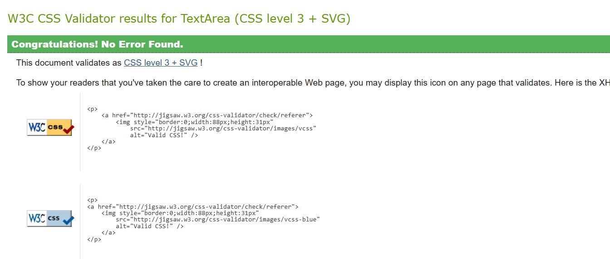
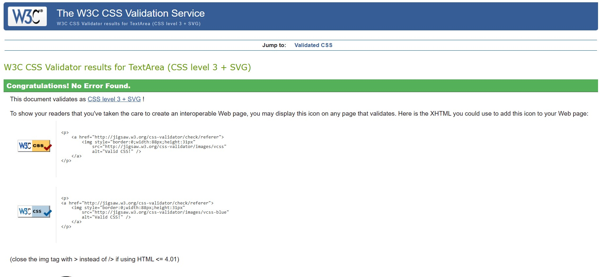
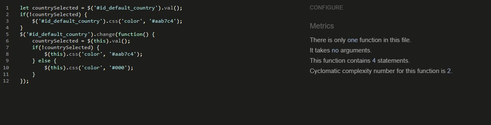
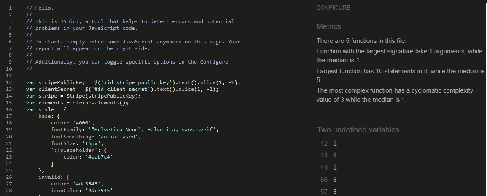
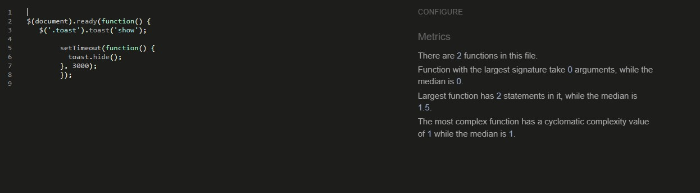

Go Back to [README.md](/README.md)

# Testing

## Code Validation

### HTML Validation

W3C Markup Validation is a service offered by W3C, that allows you to check the compliance of your HTML code with the offical standards. 
This service identifies syntax errors, improper tag usage, and other issues that might impact the structure and meaning of your web pages. By utilizing W3C Markup Validation, you can ensure that your HTML code is well-structured and conforms to established web standards.

Google Chrome web browser and the 'Inspect' function were used to capture the HTML page from the webb applications templates, which was then validated against the W3C Validator.

|Page|Validator|Result|
| --- | --- | --- |
| Home |  | Pass |
| All Products |  | Pass |
| Contact |  | Pass |
| Blog |  | Pass |
| Register |  | Pass |

### CSS

W3C Jigsaw is a tool provided by the World Wide Web Consortium (W3C) that allows you to validate and check the correctness of your HTML and CSS code. It helps ensure that your web pages comply with the standards set by the W3C, promoting interoperability and accessibility.

|File|Validator|Result|
| --- | --- | --- |
| Base |  | Pass |
| Checkout |  | Pass |
| Profile |  | Pass |

### JAVASCRIPT Validation

JSHint is a JavaScript code validator that aids in improving the quality of your JavaScript code. 

|File|Validator|Result|
| Country.js |  | Pass |
| Stripe.js |  | Pass |
| toast.js |  | Pass |