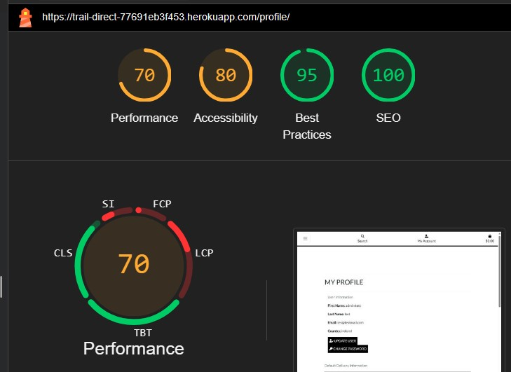
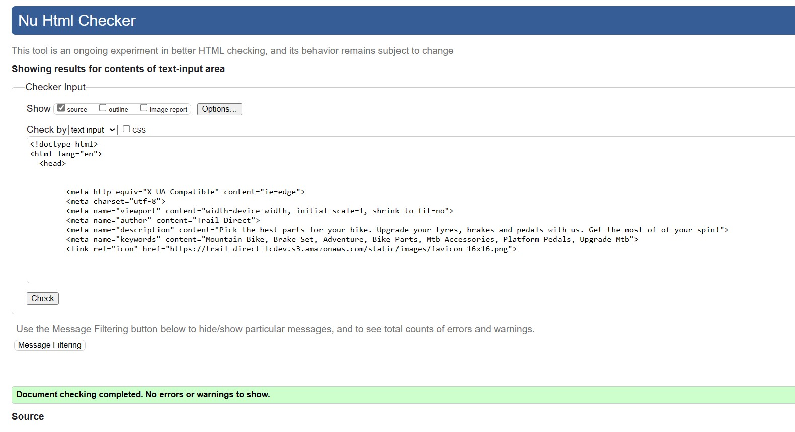

Go Back to [README.md](/README.md)

# Testing

## Manual Testing

Account Registration Tests 

 

| Test |Result  |
| -- | -- |
| User can create an account | Pass |
| Verified user can log into their account | Pass  |
| Verified user can log out | Pass  |
|User is notified of logging in to account| Pass |
|User is notified of logging out of account| Pass |
|User receives email verification email| Pass |

Home Page Tests

 

|Section|Test|Pass/Fail|
| ---| ---|---|
|Navbar|Click on logo in Navbar redirects to Home |Pass|
||Clicking on the links in Navbar redirects to the correct page |Pass|
||Clicking on the links in Account redirects to the correct page |Pass|
||Clicking on the bag icon redirects to shopping bag |Pass|
|Searchbar|Type keywords returns correct results |Pass|
|Hero section|Opening Home page the hero section loads as it should |Pass|
||Click on the shop now button leads to products page |Pass|
|Catagory Card| Click on the catagory card redirects to the correct catagory of products |Pass|
|Newsletter| Enter valid email and a thank you for subscribing text appears |Pass|
|Footer|The site links in footer open to the relevent pages|Pass|
||The socail links in footer open to the external pages|Pass|
|Admin|The admin can access the admin only dropdown menu after logging-in |Pass|

Products Page Tests

 

|Section|Test|Pass/Fail|
| ---| ---|---|
|Sorting| Click on product sorting in Navigation bar shows sorted products |Pass|
|Details| User can see product details button |Pass|
|Admin| Admins can see edit and delete buttons on each product |Pass|

Detailed Products Page Tests

 

|Section|Test|Pass/Fail|
| ---| ---|---|
|Product details|Opens the product page to show all the relevant information on selected product |Pass|
|| Clicking on add to bag button adds selected product to bag |Pass|
|| Clicking on add the quantity selector adjusts the product quantity |Pass|
|| Product catagory of product is displayed |Pass|
|| Product price is shown correctly |Pass|
|| Tab section displays the product details |Pass|
|Questions| Question tab section links to the general contact |Pass|

Shopping Bag Tests

 

|Section|Test|Pass/Fail|
| ---| ---|---|
|Shopping bag|Add product to the bag and it appears correctly in the bag |Pass|
|Update quantity|Updating product new quantity and update the bag and price |Pass|
|Remove product|Click on the remove button and the product is removed from bag |Pass|

Checkout Tests

 

|Section|Test|Pass/Fail|
| ---| ---|---|
|Payments|Users can successfully make a payment on orders |Pass|
||Loged-In Users can successfully make a payment on orders |Pass|
||If payment fails an error code will show and order is not submitted |Pass|
|Email|Users recieve an email confirmation of email after payment |Pass|
|Order|Order confirmation page after payment is successful |Pass|
||If an error when processing the order the site returns a 500 error without processing order |Pass|

Blog Tests

 

|Section|Test|Pass/Fail|
| ---| ---|---|
|Blog|All Users can view the list of posted articles |Pass|
||All Users can view selected detailed articles |Pass|
|Admin|Admins can add blog post on page |Pass|
||Admins can edit blog posts on page |Pass|
||Admins can delete blog post on page |Pass|

Profile Tests

 

|Section|Test|Pass/Fail|
| ---| ---|---|
|Profile|Only logged-in users can view profile section |Pass|
||logged-in users can view profile details |Pass|
||Only logged-in users can update personal details |Pass|
||logged-in users can update order delivery details |Pass|
||logged-in users can update personal details |Pass|
||logged-in users can change password |Pass|
||logged-in users can delete profile |Pass|
||logged-in users can view previous orders |Pass|

## Google Lighthouse Testing

> index.html

Index.html Screenshot
   

  

> products.html

Profiles.html Screenshot

   
  

## Code Validation

### HTML Validation

W3C Markup Validation is a service offered by W3C, that allows you to check the compliance of your HTML code with the offical standards. 
This service identifies syntax errors, improper tag usage, and other issues that might impact the structure and meaning of your web pages. By utilizing W3C Markup Validation, you can ensure that your HTML code is well-structured and conforms to established web standards.

Google Chrome web browser and the 'Inspect' function were used to capture the HTML page from the webb applications templates, which was then validated against the W3C Validator.

|Page|Validator|Result|
| --- | --- | --- |
| Home |  | Pass |
| All Products |  | Pass |
| Contact |  | Pass |
| Blog |  | Pass |
| Register |  | Pass |

### CSS

W3C Jigsaw is a tool provided by the World Wide Web Consortium (W3C) that allows you to validate and check the correctness of your HTML and CSS code. It helps ensure that your web pages comply with the standards set by the W3C, promoting interoperability and accessibility.

|File|Validator|Result|
| --- | --- | --- |
| Base |  | Pass |
| Checkout |  | Pass |
| Profile |  | Pass |

### Python

All Custom Python code was manually tested multiple times during and after development. Used autopep8 to format the code while going through the project to make sure that it was being made under the correct guidelines.

### JAVASCRIPT Validation

JSHint is a JavaScript code validator that aids in improving the quality of your JavaScript code. 

|File|Validator|Result|
| --- | --- | --- |
| Country.js |  | Pass |
| Stripe.js |  | Pass |
| toast.js |  | Pass |

Go Back to [README.md](/README.md)

